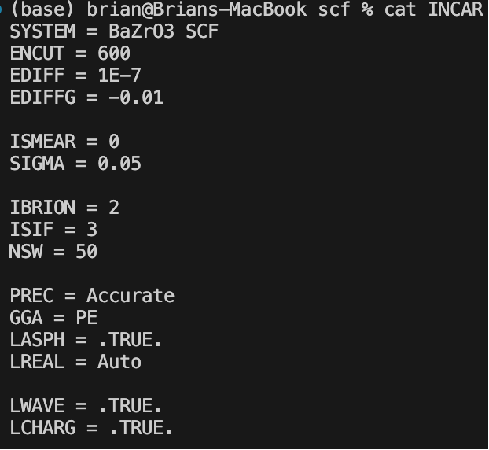
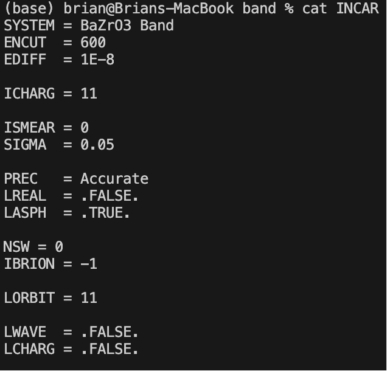
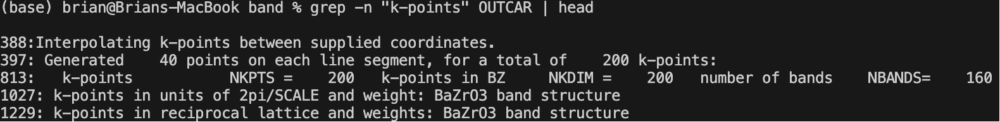
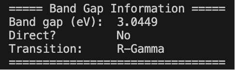
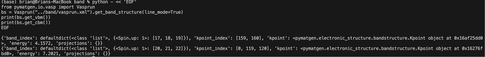
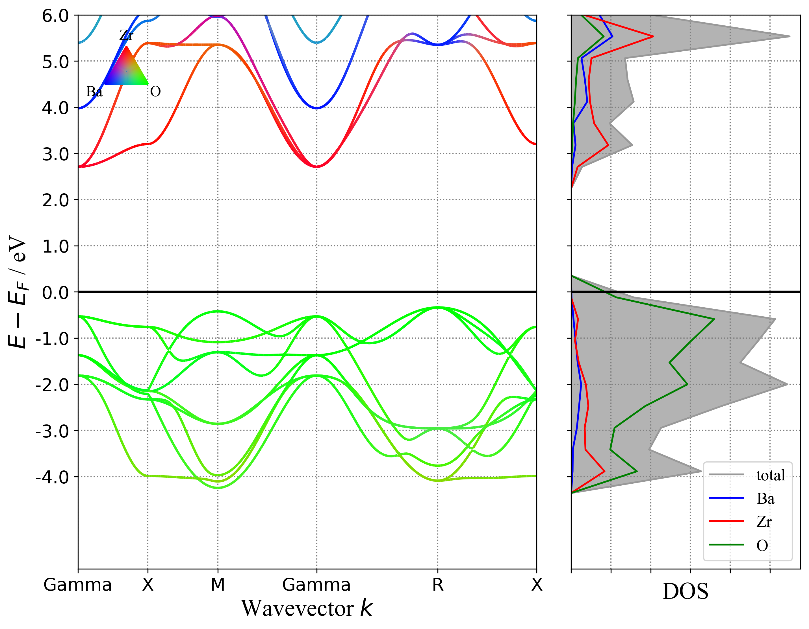
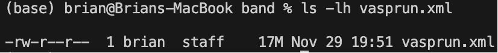
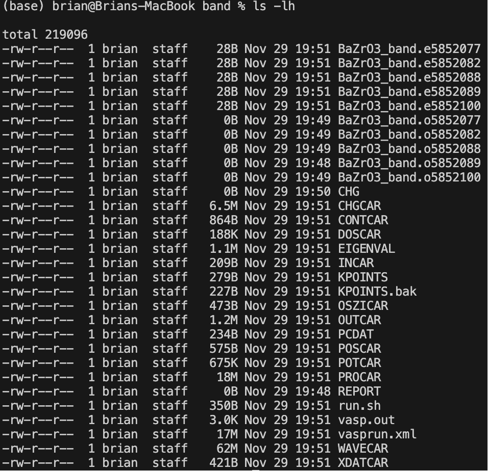

### **Band Structure Calculation of BaZrO₃: A First-Principles Study**

_24M52393 - YANG LONG_

### **1. Introduction**

In this report, we investigate the electronic band structure of **BaZrO₃**, a cubic perovskite oxide (space group _Pm-3m_), using density functional theory (DFT). The purpose of this assignment is to compute and present the band dispersion of a crystalline material **other than SiO₂**, which was covered in the lecture. BaZrO₃ is a well-studied wide-bandgap oxide with applications in proton-conducting electrolytes and energy conversion devices. Understanding its electronic structure is essential for interpreting its transport properties and chemical stability. Therefore, BaZrO₃ serves as an appropriate example for band structure analysis using first-principles methods.

### **2. Computational Methods**

#### **2.1 Software and Pseudopotentials**

All calculations were performed using **VASP 6.4.3** (Vienna Ab initio Simulation Package) from the **Ishikawa Laboratory** with the **PAW-PBE** datasets. The following PAW potentials were used:

- Ba_sv
- Zr_sv
- O

These potentials include semicore states and are suitable for accurately describing transition-metal oxides.

#### **2.2 SCF Calculation Settings**

The self-consistent field (SCF) calculation used the Perdew–Burke–Ernzerhof (PBE) exchange–correlation functional within the generalized gradient approximation (GGA). A plane-wave cutoff energy of **600 eV** was chosen after verifying convergence in the range of 450–600 eV. A **6×6×6 Monkhorst–Pack k-point mesh** was applied to sample the Brillouin zone. Electronic occupations were treated using the Gaussian smearing method with `ISMEAR = 0` and `SIGMA = 0.05`. The energy convergence threshold was set to `EDIFF = 1×10⁻⁸`. For small unit cells, VASP recommends disabling projection in real space, so `LREAL = .FALSE.` was used. The `LASPH = .TRUE.` setting was included to improve the accuracy of non-spherical contributions in PAW spheres.
The actual SCF INCAR file is shown below:

To verify proper SCF convergence, the relevant part of the terminal output is shown below:


#### **2.3 Non-SCF Band Structure Calculation**

Band structure calculations were performed in a non-self-consistent manner using the charge density obtained from the SCF step (`ICHARG = 11`). Structural relaxation was disabled by setting `NSW = 0` and `IBRION = -1`. Orbital projections were enabled via `LORBIT = 11`.
The actual Band INCAR file is shown below:

A high-symmetry **line-mode KPOINTS** file was employed using the path:

```text
Γ – X – M – Γ – R – X
```

The actual KPOINTS file is shown below:

Forty interpolation points were generated along each segment, resulting in a total of **200 k-points** used for mapping the band dispersion.
The actual KPOINTS file is shown below:


### **3. Results and Discussion**

#### **3.1 Band Structure**

The computed band structure of BaZrO₃ is shown below:


The PBE-GGA band structure exhibits a **clear electronic bandgap of approximately 3.04 eV**. Importantly, the conduction band minimum (CBM) is located at the **R point**, while the valence band maximum (VBM) lies near the **Γ point**. Therefore, BaZrO₃ is identified as an **indirect-gap semiconductor**, corresponding to an **R → Γ** transition. This is consistent with previous theoretical studies on cubic perovskite zirconates.
The script output confirming this numerical bandgap is shown below:

Extraction of VBM and CBM information:

PBE is known to underestimate bandgaps. The experimentally observed bandgap of BaZrO₃ is approximately **5–6 eV**, indicating that the PBE result captures the qualitative features but not the quantitative magnitude.

#### **3.2 Density of States and Orbital Contributions**

To provide deeper insight, the band structure was plotted together with the element-projected density of states (DOS):



The DOS analysis reveals the following key features:

- The **valence band** region (below the Fermi level) is dominated by **O 2p states**, as expected for oxide perovskites.
- The **conduction band** region (above the Fermi level) is primarily composed of **Zr 4d states**, which form the bottom of the conduction band.
- Ba contributes minimally to states near the band edges, consistent with its closed-shell electronic configuration.

These observations demonstrate that the electronic structure of BaZrO₃ is governed mainly by **O–Zr interactions**, where oxygen p orbitals hybridize with zirconium d orbitals, forming the fundamental bandgap.

### **3.3 Verification of K-point Path and Output Completeness**

Correct generation of the line-mode k-points was verified as:


This confirms:

- 40 interpolation points per segment
- **200 k-points total**
- Correct Γ–X–M–Γ–R–X path generation

Next, the completeness of `vasprun.xml` was checked:



The large file size (**~18 MB**) indicates that a **full band structure dataset** was generated.

A directory listing of the band calculation outputs is shown below:



### **4. Exchange–Correlation Functional Dependence**

The choice of exchange–correlation functional significantly influences bandgap predictions. Semi-local functionals such as LDA and PBE typically **underestimate** the true bandgap due to the absence of derivative discontinuity and the self-interaction error. In the present study, the PBE-calculated value of **3.04 eV** is indeed much lower than the experimental value of **5–6 eV**.

Hybrid functionals, particularly **HSE06**, are known to produce more accurate bandgaps for wide-bandgap oxides. Previous computational studies report that HSE06 yields bandgaps in the range of **5.0–5.5 eV** for BaZrO₃, in good agreement with experiments. Thus, while PBE captures the qualitative band dispersion and orbital character, more advanced functionals are required for quantitative predictions.

### **5. Summary**

In this report, we performed a full first-principles band structure calculation for BaZrO₃ using VASP. The SCF and non-SCF calculations were conducted using the PBE-GGA functional, and band dispersion was obtained along high-symmetry lines in the Brillouin zone. The results demonstrate that BaZrO₃ is an **indirect-bandgap semiconductor** with a PBE-calculated gap of approximately **3.04 eV**. DOS and orbital projections confirmed that the VBM originates from **O 2p** states, while the CBM is formed by **Zr 4d** states. Furthermore, the dependence of the bandgap on the exchange–correlation functional was discussed, highlighting the known underestimation by PBE.

These calculations satisfy the assignment requirement to compute and present the band dispersion of a crystalline system other than SiO₂. The discussion of computational parameters, convergence, orbital character, and functional dependence fulfills the "bonus" aspects requested in the assignment.

### **6. Data Availability and License**

All input files, calculation outputs, analysis scripts, and computational data generated in this work are made available under open-source license. The complete repository including VASP input files, plotting scripts, and raw data can be accessed at:

**GitHub Repository**: [https://github.com/Long-Brian-Yang/TAC-MI-3QMS-final](https://github.com/Long-Brian-Yang/TAC-MI-3QMS-final)

### **7. Software License and Acknowledgments**

The calculations presented in this work were performed using **VASP (Vienna Ab initio Simulation Package)**, which is commercial software developed by the University of Vienna. VASP is used under license agreement with the Ishikawa Laboratory.
